# 项目概述

<cite>
**本文档引用的文件**  
- [readme.md](file://readme.md)
- [version-relations.md](file://doc/version/version-relations.md)
- [LogicRunnerService.java](file://logic-runtime/src/main/java/com/aims/logic/runtime/service/LogicRunnerService.java)
- [LogicRunner.java](file://logic-runtime/src/main/java/com/aims/logic/runtime/runner/LogicRunner.java)
- [LogicRunnerServiceImpl.java](file://logic-sdk/src/main/java/com/aims/logic/sdk/LogicRunnerServiceImpl.java)
- [LogicIdeConfig.java](file://logic-ide/src/main/java/com/aims/logic/ide/configuration/LogicIdeConfig.java)
- [FunctionServiceLocator.java](file://logic-runtime/src/main/java/com/aims/logic/runtime/runner/FunctionServiceLocator.java)
- [ILogicItemFunctionRunner.java](file://logic-runtime/src/main/java/com/aims/logic/runtime/runner/functions/ILogicItemFunctionRunner.java)
- [HttpFunction.java](file://logic-runtime/src/main/java/com/aims/logic/runtime/runner/functions/impl/HttpFunction.java)
- [JsFunction.java](file://logic-runtime/src/main/java/com/aims/logic/runtime/runner/functions/impl/JsFunction.java)
- [JavaCodeFunction.java](file://logic-runtime/src/main/java/com/aims/logic/runtime/runner/functions/impl/JavaCodeFunction.java)
- [SwitchFunction.java](file://logic-runtime/src/main/java/com/aims/logic/runtime/runner/functions/impl/SwitchFunction.java)
</cite>

## 目录
1. [项目介绍](#项目介绍)
2. [核心特性](#核心特性)
3. [模块结构](#模块结构)
4. [可视化编排引擎](#可视化编排引擎)
5. [高性能执行](#高性能执行)
6. [状态管理与事务支持](#状态管理与事务支持)
7. [完整日志记录](#完整日志记录)
8. [REST API 接口](#rest-api-接口)
9. [典型应用场景](#典型应用场景)
10. [版本演进路径](#版本演进路径)

## 项目介绍

Logic IDE 是一个基于 Java 17 和 Spring Boot 的可视化逻辑编排引擎，旨在通过拖拽式界面设计复杂的业务流程，并提供强大的运行时执行能力。该项目采用模块化设计，包含逻辑设计、运行时执行、SDK 集成和测试套件四大核心组件。

作为可视化逻辑编排解决方案，Logic IDE 支持无状态函数式执行和有状态业务流程执行两种模式，能够满足从简单自动化任务到复杂业务流程的各种需求。系统通过 GraalVM JS 引擎实现高性能脚本执行，同时支持 JavaScript 和 Java 混合编程，为开发者提供了极大的灵活性。

项目采用微服务架构思想，将设计时（IDE）与运行时（Runtime）分离，通过 SDK 实现无缝集成。这种架构设计使得 Logic IDE 既可以作为独立的应用运行，也可以嵌入到现有的业务系统中，提供逻辑编排能力。

**Section sources**
- [readme.md](file://readme.md#L1-L10)

## 核心特性

### 可视化编排
Logic IDE 提供直观的拖拽式界面，用户可以通过图形化方式设计业务流程。系统支持多种节点类型，包括开始、结束、条件判断、HTTP 调用、JavaScript 执行、Java 代码执行等，满足不同场景的需求。

### 高性能执行
基于 GraalVM JS 引擎，Logic IDE 实现了高性能的脚本执行能力。相比传统的 JavaScript 引擎，GraalVM 提供了更好的性能和更低的内存消耗，确保复杂逻辑的快速执行。

### 状态管理
系统支持有状态业务实例，允许业务流程在执行过程中暂停并恢复。这一特性对于需要人工干预或长时间等待的业务流程尤为重要，确保了业务的连续性和可靠性。

### 事务支持
Logic IDE 提供灵活的事务边界控制，支持多种事务传播机制。用户可以根据业务需求选择合适的事务范围，确保数据的一致性和完整性。

### 完整日志
系统记录详细的执行日志，包括每个节点的输入输出、执行时间、错误信息等。通过可视化调试界面，开发者可以轻松追踪和分析业务流程的执行情况。

### REST API
提供完整的 REST 接口，便于与其他系统集成。通过标准的 HTTP 接口，外部系统可以触发逻辑执行、查询执行状态、获取执行结果等。

**Section sources**
- [readme.md](file://readme.md#L15-L38)

## 模块结构

Logic IDE 采用清晰的模块化架构，主要包含四个核心模块：

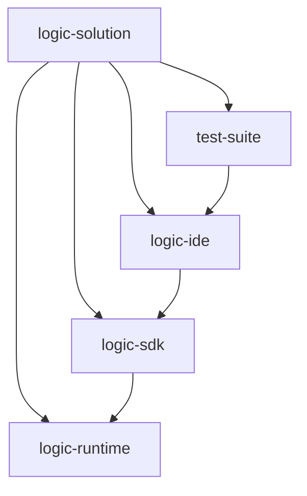

**Diagram sources**
- [readme.md](file://readme.md#L45-L49)

### logic-runtime
作为核心执行引擎，logic-runtime 负责逻辑的解析和执行。它不依赖于任何特定的用户界面，提供了纯粹的运行时能力。该模块实现了逻辑解析、节点执行、状态管理、事务控制等核心功能。

### logic-sdk
SDK 模块为业务系统提供集成能力。它封装了 runtime 的功能，提供了更友好的 API 接口。通过 logic-sdk，业务系统可以轻松地调用逻辑执行服务，实现业务流程的自动化。

### logic-ide
Web IDE 模块提供可视化的设计界面。用户可以通过拖拽方式创建和编辑业务流程，支持实时预览和调试。该模块还提供了版本管理、发布管理等功能，确保逻辑的安全性和可追溯性。

### test-suite
测试套件模块包含完整的示例和测试用例。它不仅作为项目的演示系统，还用于验证各个功能的正确性，确保系统的稳定性和可靠性。

**Section sources**
- [readme.md](file://readme.md#L51-L55)
- [WARP.md](file://WARP.md#L10-L18)

## 可视化编排引擎

Logic IDE 的可视化编排引擎是其最核心的功能之一，它将复杂的业务流程转化为直观的图形表示。

### 节点类型系统
系统采用插件化的节点类型设计，通过 `ILogicItemFunctionRunner` 接口实现节点功能的扩展。每个节点类型都有唯一的标识和执行优先级，允许自定义实现覆盖默认行为。

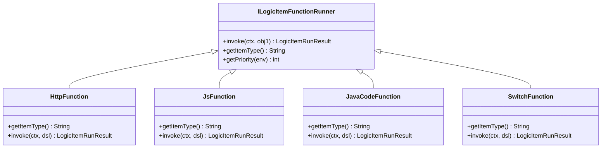

**Diagram sources**
- [ILogicItemFunctionRunner.java](file://logic-runtime/src/main/java/com/aims/logic/runtime/runner/functions/ILogicItemFunctionRunner.java#L8-L25)
- [HttpFunction.java](file://logic-runtime/src/main/java/com/aims/logic/runtime/runner/functions/impl/HttpFunction.java#L22-L117)
- [JsFunction.java](file://logic-runtime/src/main/java/com/aims/logic/runtime/runner/functions/impl/JsFunction.java#L19-L146)
- [JavaCodeFunction.java](file://logic-runtime/src/main/java/com/aims/logic/runtime/runner/functions/impl/JavaCodeFunction.java#L21-L180)
- [SwitchFunction.java](file://logic-runtime/src/main/java/com/aims/logic/runtime/runner/functions/impl/SwitchFunction.java#L15-L64)

### 节点注册机制
系统通过 `FunctionServiceLocator` 自动发现和注册节点实现类。当 Spring 容器启动时，所有实现了 `ILogicItemFunctionRunner` 接口的 Bean 都会被自动加载到执行器映射中。

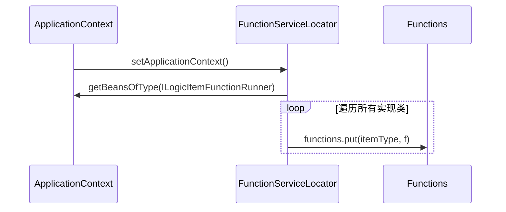

**Diagram sources**
- [FunctionServiceLocator.java](file://logic-runtime/src/main/java/com/aims/logic/runtime/runner/FunctionServiceLocator.java#L14-L29)
- [Functions.java](file://logic-runtime/src/main/java/com/aims/logic/runtime/runner/Functions.java#L48-L50)

**Section sources**
- [readme.md](file://readme.md#L33-L35)
- [LogicRunner.java](file://logic-runtime/src/main/java/com/aims/logic/runtime/runner/LogicRunner.java#L238-L249)

## 高性能执行

Logic IDE 的高性能执行能力主要体现在其核心执行引擎的设计上。

### 执行器设计
`LogicRunner` 类是核心执行器，负责整个逻辑流程的执行。它通过状态机模式管理执行过程，支持从任意节点开始执行，并能够处理复杂的分支和循环逻辑。

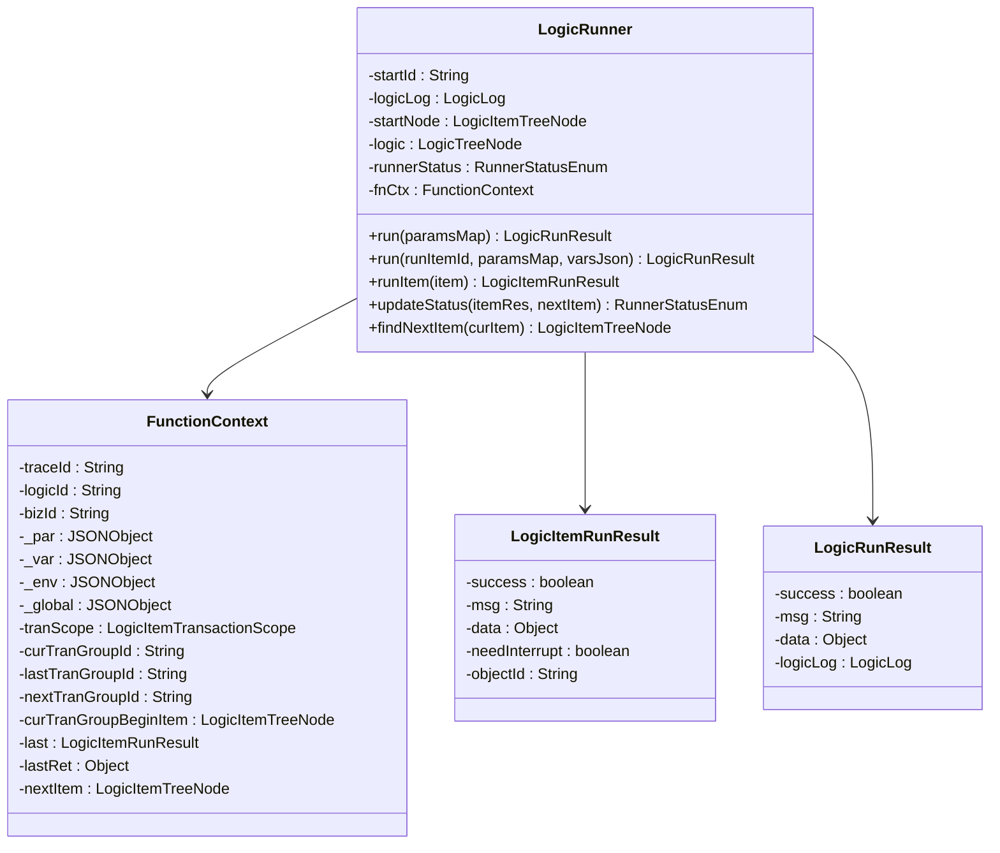

**Diagram sources**
- [LogicRunner.java](file://logic-runtime/src/main/java/com/aims/logic/runtime/runner/LogicRunner.java#L26-L289)
- [FunctionContext.java](file://logic-runtime/src/main/java/com/aims/logic/runtime/runner/FunctionContext.java#L71-L77)

### 执行流程
逻辑执行流程遵循严格的顺序，确保每个节点都能正确执行并传递结果。

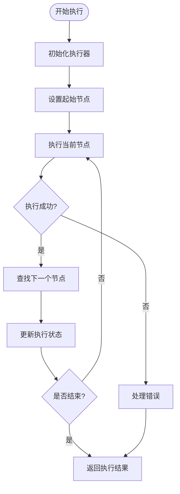

**Diagram sources**
- [LogicRunner.java](file://logic-runtime/src/main/java/com/aims/logic/runtime/runner/LogicRunner.java#L198-L200)
- [LogicRunner.java](file://logic-runtime/src/main/java/com/aims/logic/runtime/runner/LogicRunner.java#L273-L287)

**Section sources**
- [readme.md](file://readme.md#L27-L28)
- [LogicRunner.java](file://logic-runtime/src/main/java/com/aims/logic/runtime/runner/LogicRunner.java#L0-L36)

## 状态管理与事务支持

### 状态管理
系统通过 `LogicRunnerService` 接口提供状态管理功能，支持有状态业务实例的创建和执行。

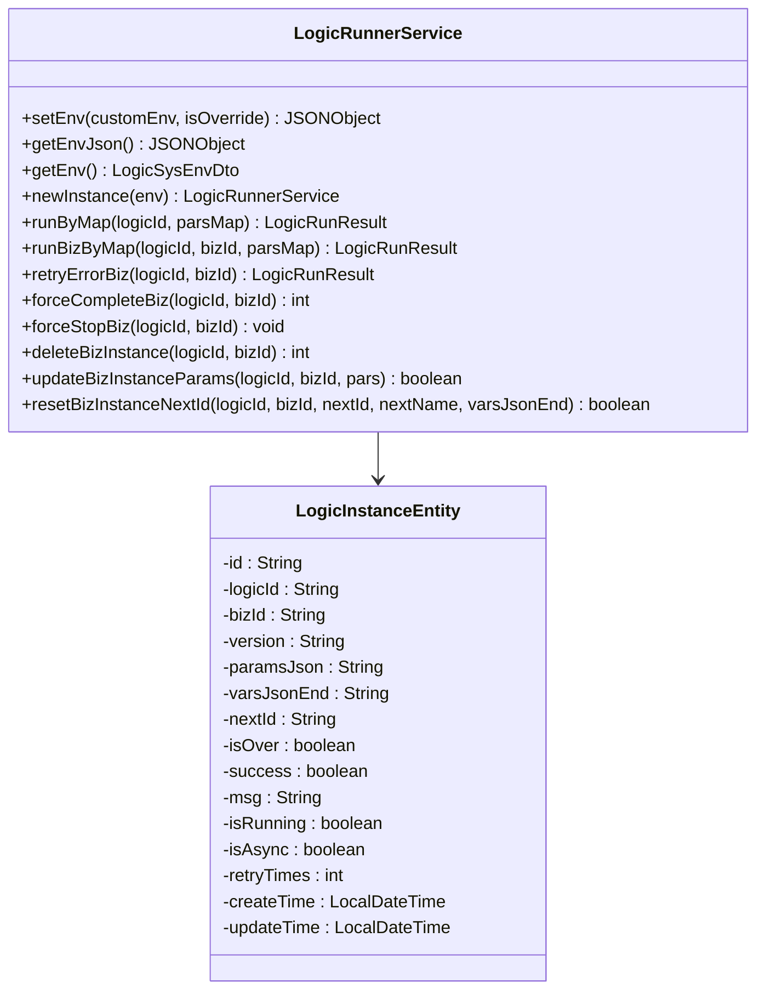

**Diagram sources**
- [LogicRunnerService.java](file://logic-runtime/src/main/java/com/aims/logic/runtime/service/LogicRunnerService.java#L12-L287)
- [LogicInstanceEntity.java](file://logic-sdk/src/main/java/com/aims/logic/sdk/entity/LogicInstanceEntity.java#L1-L20)

### 事务支持
系统提供多种事务模式，通过 `LogicItemTransactionScope` 枚举定义不同的事务边界。

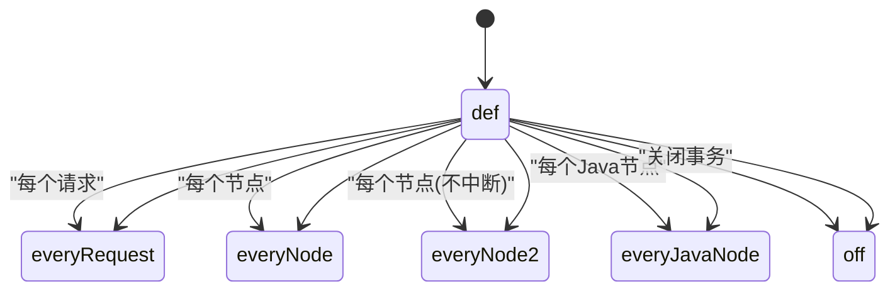

**Diagram sources**
- [LogicItemTransactionScope.java](file://logic-runtime/src/main/java/com/aims/logic/runtime/contract/enums/LogicItemTransactionScope.java#L1-L10)

**Section sources**
- [readme.md](file://readme.md#L31-L32)
- [LogicRunnerServiceImpl.java](file://logic-sdk/src/main/java/com/aims/logic/sdk/LogicRunnerServiceImpl.java#L354-L447)

## 完整日志记录

### 日志结构
系统记录详细的执行日志，包括逻辑执行日志和节点执行日志。

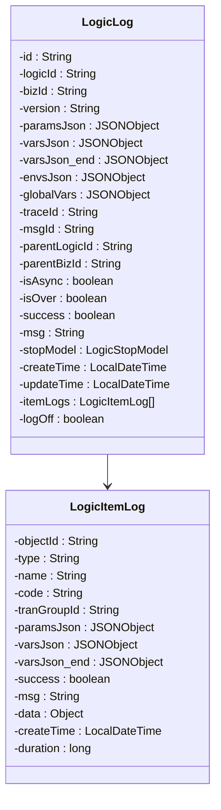

**Diagram sources**
- [LogicLog.java](file://logic-runtime/src/main/java/com/aims/logic/runtime/contract/logger/LogicLog.java#L1-L20)
- [LogicItemLog.java](file://logic-runtime/src/main/java/com/aims/logic/runtime/contract/logger/LogicItemLog.java#L1-L15)

### 日志存储配置
通过 `LogicLogServiceConfig` 配置日志存储方式，支持数据库、Elasticsearch 和内存存储。

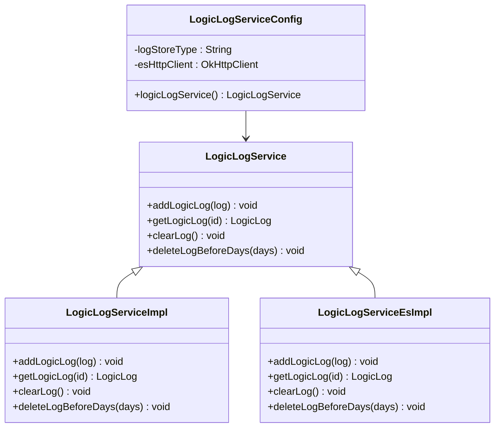

**Diagram sources**
- [LogicLogServiceConfig.java](file://logic-sdk/src/main/java/com/aims/logic/sdk/config/LogicLogServiceConfig.java#L0-L31)
- [LogicLogService.java](file://logic-sdk/src/main/java/com/aims/logic/sdk/service/LogicLogService.java#L1-L10)
- [LogicLogServiceImpl.java](file://logic-sdk/src/main/java/com/aims/logic/sdk/service/impl/LogicLogServiceImpl.java#L0-L21)
- [LogicLogServiceEsImpl.java](file://logic-sdk/src/main/java/com/aims/logic/sdk/service/impl/es/LogicLogServiceEsImpl.java#L1-L10)

**Section sources**
- [readme.md](file://readme.md#L34-L35)
- [LogicLogServiceConfig.java](file://logic-sdk/src/main/java/com/aims/logic/sdk/config/LogicLogServiceConfig.java#L0-L31)

## REST API 接口

### 运行时接口
`LogicRuntimeController` 提供 REST API 接口，支持外部系统调用逻辑执行。

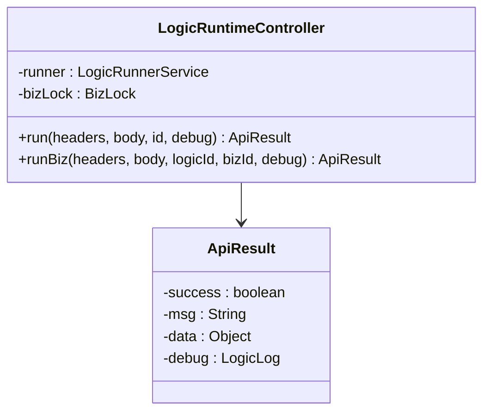

**Diagram sources**
- [LogicRuntimeController.java](file://logic-ide/src/main/java/com/aims/logic/ide/controller/LogicRuntimeController.java#L19-L49)
- [ApiResult.java](file://logic-ide/src/main/java/com/aims/logic/ide/controller/dto/ApiResult.java#L1-L10)

### 执行流程
外部系统通过 HTTP 请求调用逻辑执行，系统返回执行结果。

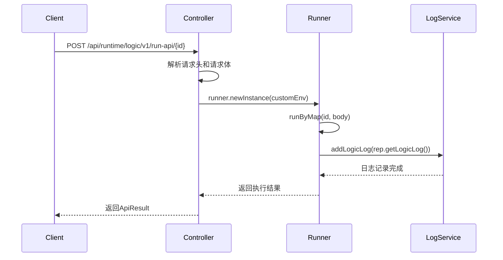

**Diagram sources**
- [LogicRuntimeController.java](file://logic-ide/src/main/java/com/aims/logic/ide/controller/LogicRuntimeController.java#L33-L49)

**Section sources**
- [readme.md](file://readme.md#L114-L125)
- [LogicRuntimeController.java](file://logic-ide/src/main/java/com/aims/logic/ide/controller/LogicRuntimeController.java#L19-L49)

## 典型应用场景

### 业务流程自动化
Logic IDE 可用于自动化复杂的业务流程，如订单处理、审批流程、数据同步等。通过可视化编排，业务人员可以轻松设计和修改流程，无需编写代码。

### 系统集成
作为系统集成的中间件，Logic IDE 可以连接不同的系统和服务。通过 HTTP 节点和自定义 Java 节点，可以实现跨系统的数据交换和业务协同。

### 数据处理管道
系统可以构建复杂的数据处理管道，从多个数据源获取数据，进行清洗、转换和聚合，最后输出到目标系统。JavaScript 节点提供了强大的数据处理能力。

### 异常处理和重试
对于可能失败的操作，系统提供了完善的异常处理和重试机制。当某个节点执行失败时，可以根据配置进行重试，确保业务的可靠性。

**Section sources**
- [readme.md](file://readme.md#L1-L192)

## 版本演进路径

### 版本关系
项目各模块的版本演进遵循一定的对应关系，确保兼容性。

| logic-ide | logic-sdk | logic-runtime | 变更说明 |
|-----------|-----------|---------------|---------|
| 0.4.3     | 0.4.4     | 0.1.9         | 新实例运行前先生成记录,增加msgId用于串联复用逻辑 |
| 0.4.1     | 0.4.3     | 0.1.8         | 复用逻辑时支持新线程异步执行 |
| 0.2.2     | 0.3.8     | 0.1.5         | sdk新增biz完成事件监听 |
| 0.2.2     | 0.3.9     | 0.1.6         | sdk新增biz完成事件监听 |

**Diagram sources**
- [version-relations.md](file://doc/version/version-relations.md#L1-L7)

### 演进趋势
从版本演进可以看出，项目主要在以下几个方面持续改进：
- **稳定性增强**：通过优化并发控制、修复各种 bug 提高系统稳定性
- **功能扩展**：不断增加新的节点类型和功能特性，如 Java 节点、等待节点等
- **性能优化**：持续优化执行性能和资源使用效率
- **易用性提升**：改进 API 设计，提供更友好的开发体验

**Section sources**
- [version-relations.md](file://doc/version/version-relations.md#L1-L7)
- [CHANGELOG.md](file://CHANGELOG.md#L226-L368)